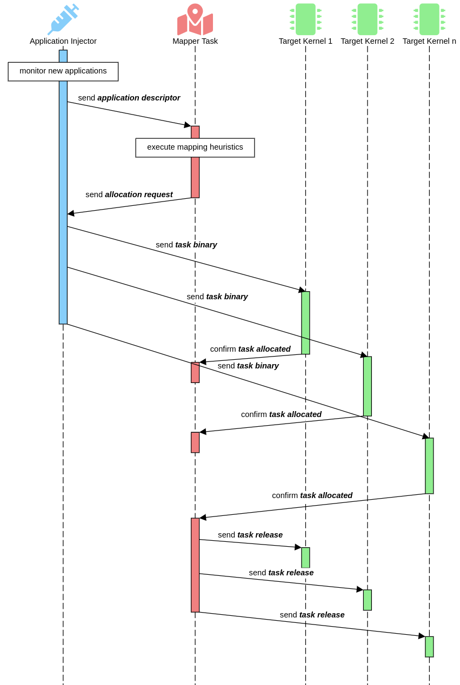

# TaskInjector


# Injection protocol

Applications may start at any moment, characterizing a dynamic workload behavior.
To support the dynamic injection of new applications, it is necessary to deploy a protocol enabling the admission of new applications into the system. 
An application can be injected by the TaskInjector.
User Applications are injected when selecting `INJECT_MAP = 0`, while the Management Application is injected by selecting `INJECT_MAP = 1`.
This differentiation occurs due to security concerns.
The figure below depics the injection protocol, which is generic, and may be deployed by other entities, as for example an Ethernet core. 



Each step of the figure above is:

1. The Injector monitors for new applications to arrive;
2. Then, it builds a packet containing the `application description` to the Mapper task;
3. The Mapper task executes its mapping heuristics;
4. The Mapper task then sends the mapping coordinates of all tasks inside an `allocation request` packet;
5. The Injector sends the binary of each task to each target PE mapped by the Mapper task;
6. The Kernel of each target PE sends a `task allocated message` to the Mapper task;
7. Finally, upon receiving the task allocated from all pending tasks, the Mapper sends a `task release` to all mapped tasks to release its execution.

## Injection steps and format

### Mapper task injection

Mapper task injection occurs at boot time for MA Injector (`INJECT_MAP = 1`).
The external environment should insert text size, data size, bss size, and entry point, in this sequence, to the TaskInjector.
Then, the mapper task binary is inserted.

Inside the TaskInjector, it builds a `TASK_ALLOCATION` packet with the binary section sizes in its header and computes
the number of flits necessary to transmit the binary with text and data section sizes.

### Application descriptor injection

To inject an application, first the descriptor should be sent.
The first data to be sent is the size of the graph descriptor (an array containing a list of successors for all tasks).
Then it should insert the number of tasks of the application.
For the number of tasks, it is sent the tuple {mapping, task type tag}, where mapping is `-1` for dynamic mapping or a PE address for static mapping, and task type tag is the identification of the management task type or `1` for user applications.
Finally, the graph descriptor array is injected.

Inside the TaskInjector, it builds a `MESSAGE_DELIVERY` packet, computing the payload size (in bytes) using the number of tasks, the graph descriptor size, and the payload header, that contains `NEW_APP` service, the injector address, and the number of tasks.

### Task injection

After sending the descriptor, the injector expects the binary and its informations to be sent, the same way its done by the mapper task injection phase.
The only thing that differs here, is that for `INJECT_MAP = 1`, there is no need to send the task 0, as it is already injected into the system.

### Allocation confirmation

The TaskInjector will only accept new applications once it has received an `APP_MAPPING_COMPLETE` from the mapper task.

# Acknowledgements

* MA-Memphis
```
Dalzotto, A. E., Ruaro, M., Erthal, L. V., and Moraes, F. G. (2021). Management Application - a New Approach to Control Many-Core Systems. In Proceedings of the Symposium on Integrated Circuits and Systems Design (SBCCI), pages 1-6.
```

* Memphis
```
Ruaro, M., Caimi, L. L., Fochi, V., and Moraes, F. G. (2019). Memphis: a framework for heterogeneous many-core SoCs generation and validation. Design Automation for Embedded Systems, 23(3-4):103-122.
```
